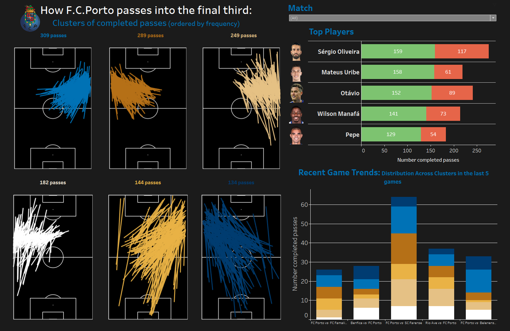

# Pass Clustering: How FCPorto passes into the final third  
The goal of this project was the creation of a tableau dashboard with a specific characteristic of a team unveiled. 
Having into account the data available, it was decided to understand how FCPorto, being the team with the best offense, passed into the final third. 

The idea was to apply a clustering method to obtain the most relevant pass groups and order them by frequency in the dashboards. 
For this, only the successfull passes into the final third were considered. However, also the passes with bad outcome (not sucessfull) were kept in the final dataset to use in tableau and visually inform about the accuracy of players usually
responsible for these passes. 

The dashboard allows us to check the 6 clusters, the top 5 players passing into the final third (the correct and failed passes) and the tendency/distribution of the passes per each cluster in the last 5 games. 
It also allows us to filter by match and player, only showing the passes made in that game and/or by the player selected. 

For this, in `Pass_Clustering_Processing.ipynb` script, the data was read, processed and the clustering method applied. Afterwards, all the relevant information for the tableau dashboard was aggregated into a final excel. 

The final tableau dashboard is the following:

